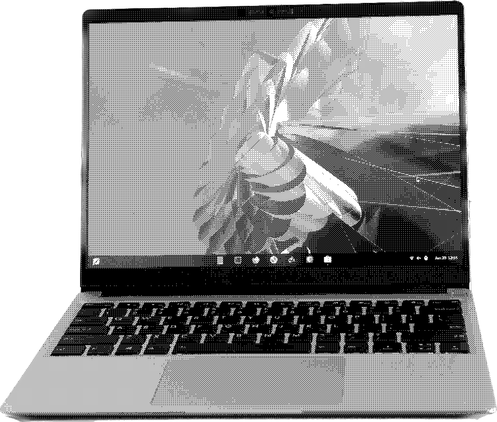

# Wrath II

Updated 2023-06-21

*This is a **device page**! To see more of my hardware notes, visit the [Devices](../devices) page.*

## Info Table

| Key           | Value                                       |
| Type          | Laptop                                      |
| Model Name    | Framework 13                                |
| Model Number  | Framework Laptop 13 (12th Gen Intel® Core™) |
| OS            | Fedora Silverblue 38                        |
| Year Made     | 2022                                        |
| Year Acquired | 2023                                        |
| CPU           | Intel Core i7-1280P                         |
| GPU           | Intel Alder Lake-P                          |
| RAM           | 32GB DDR4                                   |
| Storage       | 1TB M.2 NVMe SSD                            |

## Summary

*Wrath II* is my current primary laptop, and I absolutely love it. While I have only had a short time with it as of writing this summary, I can say with confidence that it's everything I dreamed of and more. It has a case, keyboard, and trackpad that can contend with a MacBook, repairability that can contend with an old Thinkpad, and a footprint that can contend with a Chromebook.

I actually managed to snag this machine for $400 as specced, as the previous owner claimed to have a freezing issue that I haven't been able to replicate on Fedora Silverblue. I suspect it may have either been a Windows issue, or a firmware/driver quirk solved by running updates and using a recent Linux kernel. I would have been extremely happy with my purchase even if I paid full price, but I'm happy I was able to save this machine from potentially sitting in a drawer or ending up in a landfill.

## Notes

- There's a lot of resources for making your own expansion cards:
    - [A DIY SD Card Expansion](https://www.reddit.com/r/framework/comments/qtxqa4/diy_fullsize_sd_card_expansion_card/)
    - [An STL file that can be printed to serve as a shell for a custom expansion card](https://github.com/FrameworkComputer/ExpansionCards/blob/main/Mechanical/OpenSCAD/ExpansionCard.stl)
    - [The Lite SNACK Drawer, a printable dummy card that can serve as a drawer to store things](https://www.printables.com/model/225285-framework-lite-snack-drawer)

## Software Notes

### Fedora Silverblue, June 2023 to Present

I currently have it running [Fedora Silverblue](https://silverblue.fedoraproject.org/) (with Alpine and Arch containers installed using [Distrobox](https://github.com/89luca89/distrobox) for programming and non-Flatpak apps).
