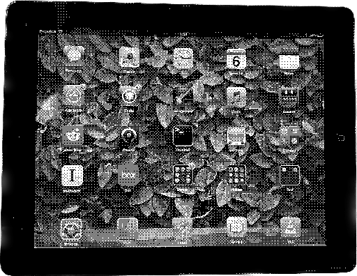

# Stuff I use

*Note: This page is currently a* ***work in progress***

**Updated 2023-04-05**

I always love seeing the technology, software, workflows and anything else that people use on a daily bases. I find that it points me towards new things to use in my own life that are tried and tested, as well as giving me a window into the way that person accomplishes their day-to-day activities.

## Devices

**I have a** ***lot*** **of devices**. A consequence of growing up in an area with a population of rich tech employees getting rid of devices every couple of years is that I have been able to easily and cheaply get my hands on more computers and electronics than I even know what to do with, and that are just old enough to be undesirable to other people. ****As a result, this won't be an exhaustive list of devices, but rather a periodically updated summary of my most-used hardware.**

***Note on hostnames:*** *My devices' hostnames are named after various sins and virtues, initially inspired by the villains of [Fullmetal Alchemist: Brotherhood](https://en.wikipedia.org/wiki/Fullmetal_Alchemist:_Brotherhood).* ***Laptops, desktops, and mobile devices are assigned sins, while servers and other headless systems are assigned virtues.*** *Hostnames are assigned, to an extent, based on a machine's purpose, so a device that replaces another (like a new phone), will have the same hostname with an incremented suffix (such as Pride being replaced by Pride II).*

### Primary Laptop: *Impenitence*

| Key           | Value                       |
| Type          | Laptop                      |
| Model         | System76 Darter Pro (darp7) |
| OS            | Fedora Silverblue 37        |
| Year Made     | 2021                        |
| Year Acquired | 2022                        |
| CPU           | Intel Core i7-1165G7        |
| GPU           | Intel Iris Xe (TGL GT2)     |
| RAM           | 16GB DDR4                   |
| Storage       | 512GB M.2 NVMe SSD          |

*Impenitence* has been my main laptop since 2022, and while it has it's quirks, I love it. It's rare for Linux-specific laptops to show up on local used markets like Craigslist, so when I saw this machine for below $500 (I paid even less, as the seller was willing to sell it to me without the RAM, and I had an identical stick on hand), I simply had to jump on it. When I left for college in the fall of 2022, I had to leave my gaming desktop behind, so I opted to loan that to my brother instead and begin using this machine as my primary laptop.

It has a gorgeous screen, decent enough keyboard, and performs exceptionally for everything I need to do. My one gripe with it is that the fan control hasn't been the greatest. Switching from Pop OS! to Fedora has massively improved this for whatever reason, but under moderate load the fans will still very quickly shift from silent to full blast. The thermal performance is simply quite poor with this machine, and I may have to look at reapplying thermal past to see if it'll help.

I currently have it running [Fedora Silverblue](https://silverblue.fedoraproject.org/) (with Arch containers installed using [Distrobox](https://github.com/89luca89/distrobox) for programming). Though running an immutable system has it's oddities, it has forced me to get more methodical about managing my system, and combined with the leaps that GNOME has made with it's recent 4x releases, has given me a very rock-solid and modern feeling experience.

### Phone: *Pride II*

| Key           | Value                       |
| Type          | Smartphone                  |
| Model         | Apple iPhone 14 Pro (15,2)  |
| OS            | iOS 16                      |
| Year Made     | 2022                        |
| Year Acquired | 2022                        |
| CPU           | Apple A16 Bionic            |
| RAM           | 6GB                         |
| Storage       | 128GB NVMe                  |

### Tablet: *Prejudice*

| Key           | Value                       |
| Type          | Tablet                      |
| Model         | Apple iPad 2 (2,1)          |
| OS            | iOS 6.3.1                   |
| Year Made     | 2011                        |
| Year Acquired | 2011                        |
| CPU           | Apple A5                    |
| RAM           | 512MB                       |
| Storage       | 16GB Flash                  |

### Sacrificial Windows Machine: *Sloth*

| Key           | Value                         |
| Type          | Laptop                        |
| Model         | Dell Latitude 3380            |
| OS            | Windows 10 Pro Education 22H2 |
| Year Made     | 2018                          |
| Year Acquired | 2021                          |
| CPU           | Intel Core i3-6006u           |
| GPU           | Intel HD Graphics 520         |
| RAM           | 4GB DDR4                      |
| Storage       | 128GB SATA SSD                |

## Stationery

### Go-to Pen: [The Pilot G2](https://www.pilotpen.us/brands/g2/)

I can't overstate my strongly-held opinions on the Pilot G2. For me, it's a pen that just works, and has the best writing feel out of anything I've tried

## Peripherals

### Mouse: [Razer Viper Mini](https://www.razer.com/gaming-mice/razer-viper-mini)

By all factors, I'd say the Razer Viper Mini is the perfect gaming mouse (for me). It's light enough, a great size, a shape that's very pleasant to hold, and only $30 to boot. What more could you ask for?

### Keyboard: [Keychron K3](https://www.keychron.com/pages/keychron-k3-wireless-mechanical-keyboard)

I love this keyboard. It's a really nice blend of form and function, and I personally feel that the low profile Gateron Brown switches are the sweet spot in terms of tactility and travel. Unfortunately, I haven't been able to use it as much as I like recently now that I primarily use a laptop out and about, but my fingers certainly wish they were typing on the Keychron right now.

### Headphones: [Airpods Pro](https://support.apple.com/kb/SP811?locale=en_US)

The ability to cancel out noise or add in extra noise with my earbuds on demand has changed my game as a college student and traveler. I'd classify them as essential.

## Footwear

### Outdooring Boots: [Timberland Chocorua Hiking Boots, Medium Brown](https://www.timberland.com/shop/mens-chocorua-waterproof-hiking-boots-brown-tan-15130214)

These boots can handle anything, and are extremely comfy. I've had them for over 3 years now, and they're just as sturdy as ever. I've added some snazzy orange laces for an extra bit of flair.

### Sneakers: [Brooks Running Adrenaline GTS 22, Alloy](https://www.brooksrunning.com/en_us/adrenaline-gts-22-mens-supportive-road-running-shoe/110366.html)

These are the first running shoes I've bought that I can actually run (I'm flat footed and need a decent amount of support from my shoes). They unfortunately seem to be slowly wearing down.

### Everyday Boots: [Timberland Port Union Waterproof Insulated Boots, Brown](https://web.archive.org/web/20211028200216/https://www.timberland.com/shop/mens-port-union-waterproof-insulated-boots-brown-tan-a2bsg210)

The Port Union is a really classy looking boot, and I was saddened to see it seems to be discontinued. These boots also have a bit of a heel, resulting in a really confident gait when wearing them.

