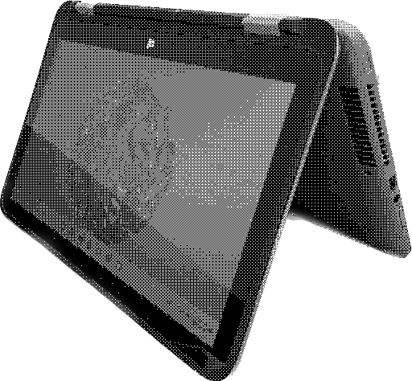
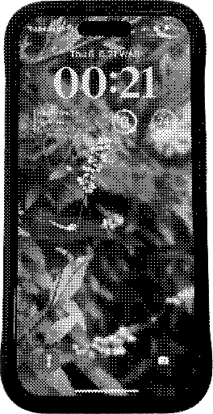
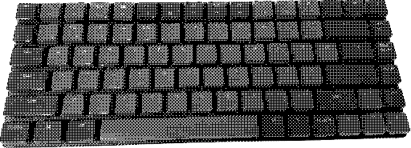
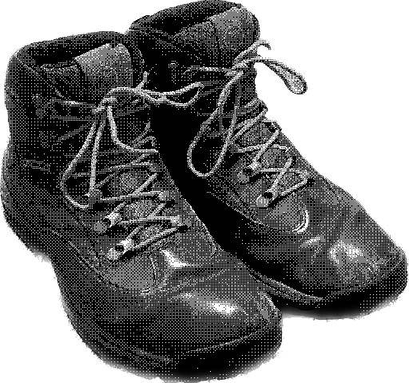

# Stuff I use

**Updated 2023-04-24**

I always love seeing the technology, software, workflows and anything else that people use on a daily bases. I find that it points me towards new things to use in my own life that are tried and tested, as well as giving me a window into the way that person accomplishes their day-to-day activities.

## Devices

*Make sure to check out the [devices page](/devices) for summaries and notes on a number of devices I've owned or used!*

### Primary Laptop(s)

[Sloth](../sloth), my Dell Latitude 3380

[Impenitence](../impenitence), my System76 Darter Pro *(It's battery failed recently, so out of commission as a laptop for the time being)*

### Sacrificial Windows Machine

[Vanity](../vanity), my HP Pavilion 13 x360

### Phone

[Pride II](../pride-ii), my iPhone 14 Pro

### Tablet

[Prejudice](../prejudice), my iPad 2

## Stationery

### Go-to Pen: [The Pilot G2](https://www.pilotpen.us/brands/g2/)

I can't overstate my strongly-held opinions on the Pilot G2. For me, it's a pen that just works, and has the best writing feel out of anything I've tried.

## Peripherals

### Mouse: [Razer Viper Mini](https://www.razer.com/gaming-mice/razer-viper-mini)

By all factors, I'd say the Razer Viper Mini is the perfect gaming mouse (for me). It's light enough, a great size, a shape that's very pleasant to hold, and only $30 to boot. What more could you ask for?

### Keyboard: [Keychron K3](https://www.keychron.com/pages/keychron-k3-wireless-mechanical-keyboard)

I love this keyboard. It's a really nice blend of form and function, and I personally feel that the low profile Gateron Brown switches are the sweet spot in terms of tactility and travel. Unfortunately, I haven't been able to use it as much as I like recently now that I primarily use a laptop out and about, but my fingers certainly wish they were typing on the Keychron right now.

### Headphones: [Airpods Pro](https://support.apple.com/kb/SP811?locale=en_US)

The ability to cancel out noise or add in extra noise with my earbuds on demand has changed my game as a college student and traveler. I'd classify them as essential.

## Footwear

### Outdooring Boots: [Timberland Chocorua Hiking Boots, Medium Brown](https://www.timberland.com/shop/mens-chocorua-waterproof-hiking-boots-brown-tan-15130214)

These boots can handle anything, and are extremely comfy. I've had them for over 3 years now, and they're just as sturdy as ever. I've added some snazzy orange laces for an extra bit of flair.

### Sneakers: [Brooks Running Adrenaline GTS 22, Alloy](https://www.brooksrunning.com/en_us/adrenaline-gts-22-mens-supportive-road-running-shoe/110366.html)

These are the first running shoes I've bought that I can actually run (I'm flat footed and need a decent amount of support from my shoes). They unfortunately seem to be (not so) slowly wearing down.

### Everyday Boots: [Timberland Port Union Waterproof Insulated Boots, Brown](https://web.archive.org/web/20211028200216/https://www.timberland.com/shop/mens-port-union-waterproof-insulated-boots-brown-tan-a2bsg210)

The Port Union is a really classy looking boot, and I was saddened to see it seems to be discontinued. These boots also have a bit of a heel, resulting in a really confident gait when wearing them.

