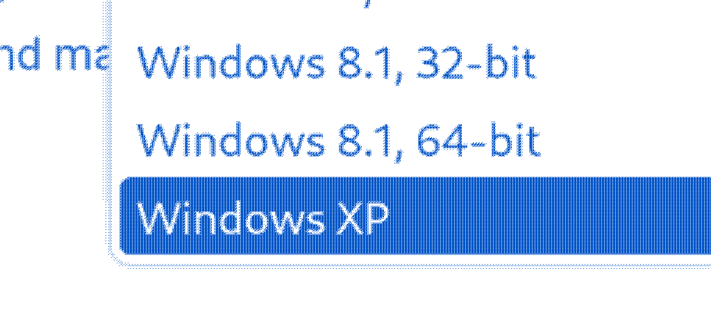

# The Best Windows XP System Is... A Dell Latitude From 2013?

2023-07-02

    
<small><i><b>Important Note:</b></i></small>

    <small><i>In this article, I describe running Windows XP in 2023. When running older Windows, particularly XP, remember to <b>be very careful about connecting the machine to the internet</b>, as these unsupported mainstream operating systems are vulnerable to a whole host of malware. I personally kept this install of Windows XP offline as a precaution.</i></small>

I've wanted to have a reliable machine running an older version of Windows for a while now, so that I can run older software and period-correct games that I have sitting around. However, I haven't had a great solution to this so far. Desktops are mostly out of the question for me, as I move around a ton being a college student, and they're big and clunky and just a hassle. However, laptops from when XP was in it's heyday require a lot of babying, often have faulty batteries, and rely on flimsy IDE laptop drives. A potential option I was leaning towards is to use a netbook, as they have more modern hardware but were still built to run Windows XP, however gaming would be out of the question, and using disc-based software (or even installing Windows XP in the first place) is much more of a chore without a built in disc drive.

When thinking about this recently, however, I remembered an interesting detail. When downloading Windows drivers for my Dell Latitude E6530, I noticed an odd entry in the list of platforms that had drivers for the laptop: **Windows XP**.

This was initially quite shocking for a machine that was made in 2013, with a third generation i5 and other modern specs, but it makes reasonable sense given that these laptops were enterprise and education machines, and there are still enterprise users today, like the US government, that make significant use of Windows XP. Digging around a bit more, I found that, at least in this Latitude E6xxx line, this laptop and it's sister models in the E6x30 generation were the last laptops to have Windows XP support, with 2014's E6x40 Latitudes dropping support. With this discovery, I decided to see just what the experience was like installing XP on this laptop.

## The Laptop

The Dell Latitude E6530 is a 15-inch business laptop released in 2013. My particular laptop has an **i5-3320M CPU**, paired with an **Nvidia NVS 5200M GPU (1GB VRAM)**, **8GB of DDR3 RAM**, and a **128GB SSD**. It also has a pretty nice keyboard, and a great selection of I/O. This may not be a brand-new gaming laptop, but it's certainly not the type of hardware you'd expect to have support for XP!

## Getting it Ready

With the relatively young age of this laptop, I first had to change some BIOS settings to ensure that everything would work well with XP. This included:

* Setting the system to Legacy Boot rather than UEFI
* Disabling Secure Boot
* Setting the SATA mode to `ATA` rather than the default `AHCI` or `RAID`
* Disabling Nvidia Optimus

None of these newer technologies were around back when XP was around, so it's important that we disable them to prevent any installation errors. I believe Dell does ship a driver for Intel RST (the `RAID` SATA mode in the BIOS), but as I'm just using an unmodified installation disc I decided to keep things simple.

## Installing XP

As this laptop has an optical drive, the actual process of installing Windows XP was pretty smooth. I installed a bog-standard copy of Windows XP Professional SP3, just went through it as a normal user would, and the whole process took just under 15 minutes.

The rough part was installing the drivers that started this whole saga in the first place. After downloading all of the relevant drivers for my model from Dell's website and copying them over to the laptop, I was greeted by this error:

Eventually, after poking around at Dell's website for a while, I found that each driver offered an alternate download of what seemed like an older driver format, and these packages worked correctly on Windows XP.

After getting all the drivers installed, and modifying some settings to taste, I was left with a pretty clean Windows XP desktop:

## Thoughts

The machine performs extraordinarily well on Windows XP, pretty unsurprisingly. While XP can only see 4GB of the system's RAM, it barely even sips at the RAM, and the CPU usually idles at 1% usage. Software runs snappily, and some games, like Rainbow Six 3: Raven Shield, play pretty well.

I think this generation of Dell Latitude makes for a great XP machine to have around, and offers significantly more utility and reliability than something like a netbook, period-correct laptop, or a desktop.
