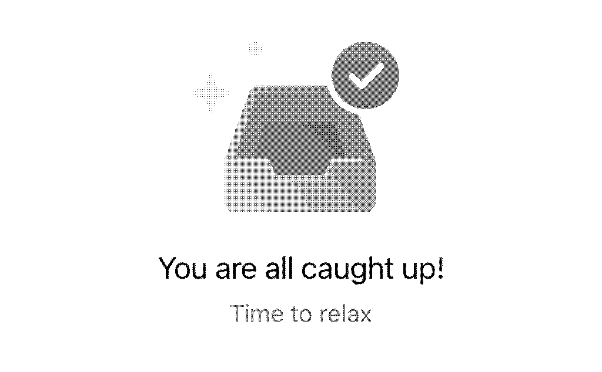

# Learning How to E-Mail Pt. 1 - Primary Mailbox

2023-06-02

*Note: This post is the first part of a planned multi-part series on learning how to manage my e-mail. Check back soon for part 2!*

It feels like my generation never really learned how to use e-mail correctly. 

I had a school provided e-mail since I was in 4th grade, and have had my own personal e-mail, the one I still used up until recently, for over a decade. Because e-mail, and other aspects of digital life, were something pushed at us from childhood rather than being a conscious choice to set up and use as an adult, it seems like I, and all of my peers, just kind of *use* e-mail, creating accounts, getting signed up for newsletters, racking up unread e-mails in the thousands, without any sense of order and organization. It becomes this chore and burden, wading through all sorts of automated annoyances just to dig out that one important e-mail from an employer or classmate.

For the longest time, my solution to this was simply to ignore it. To not use e-mail on my phone, or to just ignore the unread count on my mail app when I eventually needed to use it on my phone. I then switched to a series of e-mail apps that employ their own filtering to make a “focused inbox”. But ultimately, these are just bandaid solutions, trying to deliver a “quick fix”. When I found myself missing important college application e-mails because one of these mail apps was filtering them out erroneously, I decided that enough was enough and that I would fix my e-mail situation.

For this first phase of sorting out this messy, disjointed cluster of accounts that comprises my e-mail infrastructure, I decided to focus in first on my primary e-mail address, the one I ask people to contact me at and that handles the important accounts in my life.

## Stopping the Flow

The first step I took was to stop the flow of junk e-mails that was flowing into my primary inbox. Despite having a separate e-mail address designated for extraneous accounts and anything that was likely to get me a lot of e-mails, I still had a daily flow of newsletters, CollegeBoard [Student Search Service](https://bigfuture.collegeboard.org/for-parents/planning-for-college/student-search-service) e-mails, and other noise that I just didn't want cluttering up my inbox. Inspired by [this Reddit post](https://www.reddit.com/r/LifeProTips/comments/jgpzpr/lpt_it_only_takes_about_23_weeks_of_clicking), I took this dead simple approach to stopping the flow of unnecessary e-mails for good:

1. Mark all e-mails as read
2. Every day, open my e-mail and look at the dozen or so new e-mails I receive
3. For all of the unwanted messages, unsubscribe from the mailing list or block the sender
4. Repeat steps 2 and 3 for around a week or two until the flow of e-mails slows to a crawl

**This is seriously all it took.** To speed up the process for myself, I also retroactively went through the previous two weeks of e-mails and unsubscribed from all senders I didn't want to receive e-mails from.

This simple step solved the initial problem that spurred me to take on this project, and allowed me to start using my primary e-mail in a good old fashioned mail application like Apple Mail, without missing a single important message amidst noise.

## Taking Control

Another thing that has irked me about my e-mail situation thus far has been how it's kept me tied to Google. I have worked on slowly (but not completely) de-googling my life for some time now, largely tackling low hanging fruit like switching to DuckDuckGo and Firefox years ago, as well as ending my Google Drive and Google Photos usage, switching off of Google Maps, and overall minimizing my personal Google product usage to just YouTube and GMail. Having so much importance resting on a Google account bugged me though, with recent stories showing [just how easily Google is ready to lock you out and never respond to you again](https://www.nytimes.com/2022/08/21/technology/google-surveillance-toddler-photo.html), leaves me somewhat uneasy. Furthermore, Google is an advertising company, and between adding features I don't need, and serving ads in my inbox, I'm sure my e-mails are being scanned and analyzed in 10 different ways.

Thus, I decided to finally make the somewhat scary jump off the GMail address I've used for a majority of my life, and switch to a [Proton](https://proton.me) account, with an address on a domain that I own. Proton gives me secure and encrypted e-mail that I'm paying for with my wallet rather than my data, and using my own domain means that if Protonmail goes under for some reason, or simply if I find a better offering elsewhere, switching providers is a matter of changing a few DNS records rather than painstakingly migrating dozens of accounts like I'm having to do for this transition (it's certainly an ongoing process that I'm only in the beginning of).

Protonmail's [Easy Switch](https://proton.me/easyswitch) feature made the first few steps of the switch pretty easy, as with one button I had my 12 or so years of e-mail history in my Protonmail account (meaning to find an important e-mail in the future I'll only have to search one account), as well as setting up a forwarding rule to forward all mail from my GMail to my Proton address. From there, most of the work really revolved around cleaning up my inbox, as well as dealing with accounts, as mentioned above. 

## Cleaning Up the Mess

*Note: The mail organization in this section should have been performed* ***before*** *moving my inbox history over to Proton. I didn't, however, so I resolved to instead keep my Proton mailbox as my organized and pruned copy, and simply mass archive all messages in my Google account.*

**Nobody ever told me that you're supposed to move e-mails out of your inbox.**

As a result, a lot of talk about organizing e-mails, with folders and labels, has felt like alienspeak to me. It wasn't until I thought about it recently that it made sense, that an e-mail inbox is an intermediate place for mail *prior* to it's final destination, rather than being the final destination itself. Yet another aspect of e-mail that I had never learned about due to e-mail being pushed at us from too young of an age.

With this new insight, another goal was added to my e-mail extravaganza: **getting to 0 messages in my primary inbox, while purging all unnecessary mail from the past decade**. I started with ~18,000 messages in my inbox, and it ended up taking around a week of intermittent cleanup sessions to get that down to 0. 

I first started by searching for e-mails that I knew I wanted kept, and archiving them so that they didn't accidentally get deleted. This included filtering for senders like family members, partners, my university, and past employers. I then used creative search terms to try and capture large amounts of e-mails I knew I wanted gone, such as:

- " sale" (the leading space was important in not picking up unrelated messages)
-  ".edu" (to get rid of spammy e-mails from colleges)
-  "newsletter" (to get rid of various company newsletters)
-  "notification" (for various services that I didn't disable e-mail notifications for)
-  "verify" (for all of those e-mail verification or two-factor messages)

I then systematically filtered through my inbox, finding different senders and either trashing or archiving all of their messages, and finished it off with a manual review of a couple hundred messages that didn't get categorized through any of the above actions. 

At long last, I was faced with a completely empty inbox.

## Conclusion

With admittedly some work, yet not an impossible amount of effort, my personal mailbox has gone from being that drawer full of junk that I try to open as little as possible to being an organized space that I feel ownership of and have control over. It's a pride point of my digital life rather than an annoyance. I hope that my journey to make this step off Google, and take control of my inbox, my e-mail address, and my e-mail management, inspires others to do the same and make e-mail work as it's supposed to.

The next step in this process, beyond migrating accounts to my new e-mail address, is going to be to apply some of these insights to my other inboxes, as well as deleting and consolidating e-mail accounts where possible to create a comprehensive e-mail handling strategy that extends beyond just this personal address, and I plan to outline that journey in a second part to this series.

---

## Resources

- [r/degoogle](https://reddit.com/r/degoogle) - This subreddit has some good resources and links about degoogling in a broad sense, and has others going through a similar transition away from GMail. [r/privacy](https://reddit.com/r/privacy) is also a great resource, but more general.
- [The Inbox Zero Series](https://web.archive.org/web/20140317005022/http://inboxzero.com/articles) - A really useful collection of insights about e-mail management and how to handle it effectively. The series includes [a post on processing an inbox down to 0](https://web.archive.org/web/20140409230155/http://www.43folders.com/2006/03/27/process-to-zero), and this may be a good starting point if you have more e-mails to work through than I did.

## Appendix A: Choosing an e-mail provider

There's a good few options for paid e-mail providers out there that fit some of my requirements, and while I chose Proton, that may not be the best choice for everyone. This appendix goes over some of the providers I considered, and why I did or did not go for them. I primarily looked for providers that I pay for with money, rather than data, that were at least somewhat privacy-respecting, and that would let me use my own domain name. Another important factor for me was longevity, for my primary address I'm not interested in buying into a specific provider and workflow unless I know it will be around in the long run, and doubly so for encrypted mail providers that often require users to only use their applications to access e-mail rather than being able to use any IMAP/SMTP client.

### [Proton](https://proton.me)

This is the provider I went with, as it was reasonably priced, fit all of my requirements, and had the additional bonus of being encrypted and secure, as well as providing other services alongside e-mail such as cloud storage and calendar management (I have yet to significantly make use of either, but they're not bad perks to have). I also believe in Proton's longevity, and feel confident that they'll continue to be around for a bit.

For **$4.99/mo** ($47.88/yr) on their "Mail Plus" tier, you get **15GB of storage** (more than enough for me at the moment), **10 e-mail addresses**, and the ability to use 1 custom domain for e-mail. **The 15gb of storage can also be shared with Proton Drive**, their cloud storage service, and the plan also gives you the ability to create **25 calendars** on Proton Calendar.

It's not all sunshine and roses however, as there are some drawbacks. The first is that their web client isn't perfect. It's good enough, but doesn't have any "select all" feature, and can be slow at times. They do let you search the contents of e-mails now, which is a pain point that some have mentioned in the past, but it's not perfect. The biggest drawback, however, is **not being able to use third-party clients on mobile**. On desktop, you can use a third-party mail app like Thunderbird with their [Proton Bridge](https://proton.me/mail/bridge) application, but this isn't available for mobile, forcing users onto the official Protonmail app. This is understandable, given that IMAP and SMTP were never designed with encrypted e-mail platforms in mind, but is nonetheless unfortunate. The iOS app isn't too bad though, so this is a compromise I'm willing to make for the promise of additional security.

### [Fastmail](https://www.fastmail.com/)

Fastmail came in second place for me, as it's a lot of the good of Proton, but without any encryption, meaning that it doesn't suffer from a lot of the drawbacks that Proton has. It advertises privacy-first e-mail, and doesn't have any ads. It also offers a bit more for a similar price to Proton.

For **$5.00/mo** ($50.00/yr) on their "Standard" tier, you get **30GB** of storage, **600 e-mail addresses**, either on your own domain or on one of their [many domains](https://www.fastmail.com/about/ourdomains/), **access to their calendar service**, as well as the ability to use any IMAP/SMTP client.

Honestly, Fastmail has a very compelling offering, and I've seen others on the internet using it, so it was a very tough decision between this and Proton, but ultimately I settled on Proton due to Proton Drive, as well as simply having a bit more experience with the platform (I've used their free tier for a few accounts here and there over the years and have watched it grow). The encryption is also a solid "nice to have", even if I'm not entirely sure how much I care about it due to pretty much all of my e-mail correspondence being with GMail or Outlook addresses, meaning my messages end up passing through Google or Microsoft's servers anyways. There is still a chance I may move to Fastmail later, and I'm considering giving their free trial a shot, but am somewhat unclear how I would actually go about testing their services. 

### [Tutanota](https://tutanota.com)

Tutanota was also in contention, being Proton's primary competition in the private and encrypted e-mail business. Their pricing is certainly pretty good if you just want e-mail and calendars, and they have similar promises as Proton of encrypted e-mail storage and end-to-end encryption of messages between Tutanota users.

For **€1.20/mo** (€12/yr), on their "Premium" tier, you get **1GB storage** (but this can be upgraded à la carte for a reasonable price), **6 e-mail addresses**, **custom domain support**, and **unlimited calendars**.

The big downside with Tutanota is that they don't an equivalent to Proton's "Proton Bridge", meaning that IMAP/SMTP clients can't be used, even on desktop. They do have native desktop applications in addition to mobile, but I would prefer the freedom to choose which client I use for mail on the desktop. Additionally, as stated with Fastmail, I'm just more familiar with Proton's offering, hence why I opted for them over Tutanota.

### Honorable Mentions

- [Posteo](https://posteo.de/en) - Great price, but seems like more of a barebones offering compared to the others. I may consider this service if I need a cheap secondary address under another domain.
- [iCloud](https://www.icloud.com/mail) - $0.99/mo for 50GB or $2.99/mo for 200GB, as well as custom domain support and a whole host of other features is a great deal, and I already pay for the 200GB storage tier for iCloud Photos anyways, but I want to reduce my reliance on Apple services rather than increase it. If you use a number of Apple devices and are fine with getting bought into the ecosystem, however, this is arguably the most compelling offering out there.